# F1r3Drive Architecture

## Overview

F1r3Drive is a FUSE-based filesystem implementation in Java that integrates with the F1r3fly blockchain network. It provides a virtual filesystem interface where users can interact with blockchain data as if it were regular files and directories.

## Architecture Diagram

```plantuml
@startuml F1r3Drive_Architecture

!define ABSTRACT abstract
!define INTERFACE interface

package "Application Layer" {
    class F1r3DriveCli {
        -validatorHost: String
        -validatorPort: int
        -observerHost: String
        -observerPort: int
        -cipherKeyPath: String
        -mountPoint: Path
        -revAddress: String
        -privateKey: String
        -manualPropose: boolean
        -f1r3DriveFuse: F1r3DriveFuse
        +call(): Integer
        +main(args: String[]): void
    }

    class F1r3DriveFuse {
        -blockchainClient: F1r3flyBlockchainClient
        -fileSystem: FileSystem
        +mount(mountPoint: Path, foreground: boolean): void
        +umount(): void
        +mountAndUnlockRootDirectory(mountPoint: Path, foreground: boolean, revAddress: String, privateKey: String): void
    }
}

package "FUSE Layer" {
    INTERFACE FuseFS {
        +getattr(path: String, stat: FileStat): int
        +mkdir(path: String, mode: long): int
        +mknod(path: String, mode: long, dev: long): int
        +unlink(path: String): int
        +rmdir(path: String): int
        +rename(path: String, newPath: String): int
        +chmod(path: String, mode: long): int
        +chown(path: String, uid: long, gid: long): int
        +truncate(path: String, size: long): int
        +open(path: String, fi: FuseFileInfo): int
        +read(path: String, buf: Pointer, size: long, offset: long): int
        +write(path: String, buf: Pointer, size: long, offset: long): int
        +flush(path: String, fi: FuseFileInfo): int
        +release(path: String, fi: FuseFileInfo): int
        +opendir(path: String, fi: FuseFileInfo): int
        +readdir(path: String, buf: Pointer, filler: FuseFillDir): int
        +releasedir(path: String, fi: FuseFileInfo): int
        +statfs(path: String, stbuf: Statvfs): int
    }

    class AbstractFuseFS {
        #fileSystem: FileSystem
        +getattr(path: String, stat: FileStat, fuseContext: FuseContext): int
        +mkdir(path: String, mode: long): int
        +mknod(path: String, mode: long, dev: long): int
        +unlink(path: String): int
        +rmdir(path: String): int
        +rename(path: String, newPath: String): int
        +truncate(path: String, size: long): int
        +open(path: String): int
        +read(path: String, buf: Pointer, size: long, offset: long): int
        +write(path: String, buf: Pointer, size: long, offset: long): int
        +flush(path: String): int
        +opendir(path: String): int
        +readdir(path: String, buf: Pointer, filler: FuseFillDir): int
        +statfs(path: String, stbuf: Statvfs): int
    }

    class FuseStubFS {
        +mount(mountPoint: Path, foreground: boolean): void
        +umount(): void
    }

    class FuseCallbacks {
        +registerCallback(operation: String, callback: Callback): void
        +triggerCallback(operation: String, args: Object[]): Object
    }

    AbstractFuseFS ..|> FuseFS
    FuseStubFS --> AbstractFuseFS
}

package "Filesystem Layer" {
    INTERFACE FileSystem {
        +getFile(path: String): File
        +getDirectory(path: String): Directory
        +isRootPath(path: String): boolean
        +getParentPath(path: String): String
        +createFile(path: String, mode: long): void
        +getAttributes(path: String, stat: FileStat, fuseContext: FuseContext): void
        +makeDirectory(path: String, mode: long): void
        +readFile(path: String, buf: Pointer, size: long, offset: long): int
        +readDirectory(path: String, buf: Pointer, filter: FuseFillDir): void
        +getFileSystemStats(path: String, stbuf: Statvfs): void
        +renameFile(path: String, newName: String): void
        +removeDirectory(path: String): void
        +truncateFile(path: String, offset: long): void
        +unlinkFile(path: String): void
        +openFile(path: String): void
        +writeFile(path: String, buf: Pointer, size: long, offset: long): int
        +flushFile(path: String): void
        +unlockRootDirectory(revAddress: String, privateKey: String): void
        +changeTokenFile(tokenFilePath: String): void
        +terminate(): void
        +waitOnBackgroundDeploy(): void
    }

    class InMemoryFileSystem {
        -root: RootDirectory
        -blockchainContext: BlockchainContext
        -stateManager: StateChangeEventsManager
        +getFile(path: String): File
        +getDirectory(path: String): Directory
        +isRootPath(path: String): boolean
        +getParentPath(path: String): String
        +createFile(path: String, mode: long): void
        +makeDirectory(path: String, mode: long): void
        +readFile(path: String, buf: Pointer, size: long, offset: long): int
        +readDirectory(path: String, buf: Pointer, filter: FuseFillDir): void
        +renameFile(path: String, newName: String): void
        +removeDirectory(path: String): void
        +truncateFile(path: String, offset: long): void
        +unlinkFile(path: String): void
        +openFile(path: String): void
        +writeFile(path: String, buf: Pointer, size: long, offset: long): int
        +flushFile(path: String): void
        +unlockRootDirectory(revAddress: String, privateKey: String): void
        +changeTokenFile(tokenFilePath: String): void
        +terminate(): void
        +waitOnBackgroundDeploy(): void
    }

    InMemoryFileSystem ..|> FileSystem
}

package "Filesystem Nodes" {
    INTERFACE Path {
        +getAttr(stat: FileStat, fuseContext: FuseContext): void
        +getName(): String
        +getAbsolutePath(): String
        +getLastUpdated(): Long
        +getParent(): Directory
        +delete(): void
        +rename(newName: String, newParent: Directory): void
        +cleanLocalCache(): void
        +getBlockchainContext(): BlockchainContext
    }

    INTERFACE Directory {
        +listChildren(): Map<String, Path>
        +getChild(name: String): Path
        +addChild(name: String, child: Path): void
        +removeChild(name: String): void
        +isReadOnly(): boolean
    }

    INTERFACE File {
        +getSize(): long
        +getContent(): byte[]
        +write(data: byte[]): void
        +read(offset: long, size: int): byte[]
    }

    class AbstractPath {
        #name: String
        #absolutePath: String
        #lastUpdated: Long
        #parent: Directory
        #blockchainContext: BlockchainContext
        +getAttr(stat: FileStat, fuseContext: FuseContext): void
        +getName(): String
        +getAbsolutePath(): String
        +getLastUpdated(): Long
        +getParent(): Directory
        +getBlockchainContext(): BlockchainContext
    }

    class RootDirectory {
        -children: Map<String, Path>
        -walletDirectories: Map<String, UnlockedWalletDirectory>
        +listChildren(): Map<String, Path>
        +getChild(name: String): Path
        +addChild(name: String, child: Path): void
        +removeChild(name: String): void
        +isReadOnly(): boolean
    }

    class LockedWalletDirectory {
        -revAddress: String
        +isReadOnly(): boolean
        +unlock(privateKey: String): UnlockedWalletDirectory
    }

    class UnlockedWalletDirectory {
        -blockchainContext: BlockchainContext
        -children: Map<String, Path>
        +listChildren(): Map<String, Path>
        +getChild(name: String): Path
        +addChild(name: String, child: Path): void
        +removeChild(name: String): void
        +isReadOnly(): boolean
    }

    class TokenDirectory {
        -tokenValue: String
        -children: Map<String, Path>
        +listChildren(): Map<String, Path>
        +getChild(name: String): Path
        +addChild(name: String, child: Path): void
        +removeChild(name: String): void
        +isReadOnly(): boolean
    }

    class TokenFile {
        -tokenValue: String
        +getSize(): long
        +getContent(): byte[]
        +read(offset: long, size: int): byte[]
    }

    class BlockchainDirectory {
        -blockchainContext: BlockchainContext
        -children: Map<String, Path>
        +listChildren(): Map<String, Path>
        +getChild(name: String): Path
        +addChild(name: String, child: Path): void
        +removeChild(name: String): void
        +isReadOnly(): boolean
    }

    class BlockchainFile {
        -blockchainContext: BlockchainContext
        -content: byte[]
        +getSize(): long
        +getContent(): byte[]
        +write(data: byte[]): void
        +read(offset: long, size: int): byte[]
    }

    class FetchedDirectory {
        -fetchedData: Map<String, byte[]>
        -children: Map<String, Path>
        +listChildren(): Map<String, Path>
        +getChild(name: String): Path
        +addChild(name: String, child: Path): void
        +removeChild(name: String): void
        +isReadOnly(): boolean
    }

    class FetchedFile {
        -content: byte[]
        +getSize(): long
        +getContent(): byte[]
        +read(offset: long, size: int): byte[]
    }

    AbstractPath ..|> Path
    RootDirectory --> Directory
    LockedWalletDirectory --> AbstractPath
    UnlockedWalletDirectory --> AbstractPath
    UnlockedWalletDirectory --> Directory
    TokenDirectory --> AbstractPath
    TokenDirectory --> Directory
    TokenFile --> AbstractPath
    TokenFile --> File
    BlockchainDirectory --> AbstractPath
    BlockchainDirectory --> Directory
    BlockchainFile --> AbstractPath
    BlockchainFile --> File
    FetchedDirectory --> AbstractPath
    FetchedDirectory --> Directory
    FetchedFile --> AbstractPath
    FetchedFile --> File
}

package "Blockchain Layer" {
    class BlockchainContext {
        -walletInfo: RevWalletInfo
        -deployDispatcher: DeployDispatcher
        +getWalletInfo(): RevWalletInfo
        +getDeployDispatcher(): DeployDispatcher
        +getBlockchainClient(): F1r3flyBlockchainClient
    }

    class F1r3flyBlockchainClient {
        -validatorHost: String
        -validatorPort: int
        -observerHost: String
        -observerPort: int
        -manualPropose: boolean
        -validatorChannel: Channel
        -observerChannel: Channel
        +deploy(rholangExpression: String): DeployResponse
        +read(rholangExpression: String): ReadResponse
        +getBalance(revAddress: String): long
        +proposeBlock(): void
        +finalizeBlock(): void
    }

    class DeployDispatcher {
        -blockchainClient: F1r3flyBlockchainClient
        -queue: Queue<Deploy>
        +dispatch(deploy: Deploy): void
        +getDeployResult(deployId: String): DeployResult
        +getBlockchainClient(): F1r3flyBlockchainClient
    }

    class RevWalletInfo {
        -revAddress: String
        -publicKey: String
        -privateKey: String
        +getRevAddress(): String
        +getPublicKey(): String
        +getPrivateKey(): String
    }

    class RholangExpressionConstructor {
        +buildWriteExpression(path: String, data: byte[]): String
        +buildReadExpression(path: String): String
        +buildListExpression(path: String): String
        +buildDeleteExpression(path: String): String
    }

    class PrivateKeyValidator {
        +validate(privateKey: String): boolean
        +validateFormat(privateKey: String): boolean
        +validateChecksum(privateKey: String): boolean
    }

    BlockchainContext --> RevWalletInfo
    BlockchainContext --> DeployDispatcher
    DeployDispatcher --> F1r3flyBlockchainClient
    F1r3flyBlockchainClient --> RholangExpressionConstructor
    RevWalletInfo --> PrivateKeyValidator
}

package "State Management Layer" {
    INTERFACE EventQueue {
        +offer(event: StateChangeEvent): boolean
        +poll(timeout: long, unit: TimeUnit): StateChangeEvent
        +size(): int
        +clear(): void
    }

    INTERFACE EventProcessorRegistry {
        +register(eventType: String, processor: EventProcessor): void
        +unregister(eventType: String): void
        +getProcessor(eventType: String): EventProcessor
        +getAllProcessors(): Collection<EventProcessor>
    }

    INTERFACE EventProcessor {
        +process(event: StateChangeEvent): void
    }

    class BlockingEventQueue {
        -queue: BlockingQueue<StateChangeEvent>
        -capacity: int
        +offer(event: StateChangeEvent): boolean
        +poll(timeout: long, unit: TimeUnit): StateChangeEvent
        +size(): int
        +clear(): void
    }

    class DefaultEventProcessorRegistry {
        -processors: Map<String, EventProcessor>
        +register(eventType: String, processor: EventProcessor): void
        +unregister(eventType: String): void
        +getProcessor(eventType: String): EventProcessor
        +getAllProcessors(): Collection<EventProcessor>
    }

    class DefaultEventProcessor {
        +process(event: StateChangeEvent): void
        -handleEvent(event: StateChangeEvent): void
    }

    class StateChangeEventsManager {
        -eventQueue: EventQueue
        -processorRegistry: EventProcessorRegistry
        -eventProcessor: EventProcessor
        -eventProcessingThreadPool: ExecutorService
        -eventDispatcherThread: Thread
        -config: StateChangeEventsManagerConfig
        -shutdown: volatile boolean
        +publishEvent(event: StateChangeEvent): void
        +onStateChange(event: StateChangeEvent): void
        +shutdown(): void
        +waitForCompletion(): void
    }

    class StateChangeEventsManagerConfig {
        -queueCapacity: int
        -threadPoolSize: int
        -threadNamePrefix: String
        +getQueueCapacity(): int
        +getThreadPoolSize(): int
        +getThreadNamePrefix(): String
        +defaultConfig(): StateChangeEventsManagerConfig
    }

    class StateChangeEventProcessor {
        +process(event: StateChangeEvent): void
    }

    class StateChangeEvents {
        +FileCreated(path: String, timestamp: long): Event
        +FileDeleted(path: String, timestamp: long): Event
        +FileModified(path: String, timestamp: long): Event
        +DirectoryCreated(path: String, timestamp: long): Event
        +DirectoryDeleted(path: String, timestamp: long): Event
    }

    BlockingEventQueue ..|> EventQueue
    DefaultEventProcessorRegistry ..|> EventProcessorRegistry
    DefaultEventProcessor ..|> EventProcessor
    StateChangeEventProcessor ..|> EventProcessor
    StateChangeEventsManager --> EventQueue
    StateChangeEventsManager --> EventProcessorRegistry
    StateChangeEventsManager --> StateChangeEventsManagerConfig
    StateChangeEventsManager --> EventProcessor
}

package "Security & Encryption" {
    class AESCipher {
        -{static} instance: AESCipher
        -cipher: Cipher
        -key: SecretKey
        -{static} init(keyPath: String): void
        +encrypt(plaintext: String): String
        +decrypt(ciphertext: String): String
        +{static} getInstance(): AESCipher
    }

    class SecurityUtils {
        +{static} validatePermissions(path: String, requiredPermission: int): boolean
        +{static} getCurrentUser(): String
        +{static} getFileOwner(path: String): String
    }
}

package "Error Handling" {
    class F1r3DriveError {
        -errorCode: int
        -errorMessage: String
        +getErrorCode(): int
        +getErrorMessage(): String
    }

    class PathNotFound extends F1r3DriveError
    class FileAlreadyExists extends F1r3DriveError
    class DirectoryNotEmpty extends F1r3DriveError
    class OperationNotPermitted extends F1r3DriveError
    class PathIsNotAFile extends F1r3DriveError
    class PathIsNotADirectory extends F1r3DriveError
    class NoDataByPath extends F1r3DriveError
    class InvalidSigningKeyException extends F1r3DriveError
    class F1r3flyDeployError extends F1r3DriveError
}

' Relationships
F1r3DriveCli --> F1r3DriveFuse
F1r3DriveFuse --> FuseStubFS
F1r3DriveFuse --> InMemoryFileSystem
AbstractFuseFS --> FileSystem
FuseStubFS --> FuseCallbacks
InMemoryFileSystem --> RootDirectory
InMemoryFileSystem --> BlockchainContext
InMemoryFileSystem --> StateChangeEventsManager
RootDirectory --> Path
UnlockedWalletDirectory --> BlockchainContext
BlockchainDirectory --> BlockchainContext
StateChangeEventsManager --> StateChangeEvents
F1r3DriveCli --> AESCipher
F1r3flyBlockchainClient --> SecurityUtils

@enduml
```

## Core Components

### 1. Application Layer
- **F1r3DriveCli**: Command-line interface entry point that parses arguments and initializes the application
- **F1r3DriveFuse**: Initializes and manages the FUSE filesystem lifecycle

### 2. FUSE Layer
- **FuseFS**: Interface defining all FUSE operations
- **AbstractFuseFS**: Base implementation handling common FUSE operation logic
- **FuseStubFS**: Bridge between FUSE library and the filesystem layer
- **FuseCallbacks**: Registers and triggers FUSE operation callbacks

### 3. Filesystem Layer
- **FileSystem**: Interface defining all filesystem operations
- **InMemoryFileSystem**: In-memory implementation managing the virtual filesystem

### 4. Filesystem Nodes
- **Path**: Base interface for all filesystem entities
- **AbstractPath**: Common implementation for all path types
- **Directory**: Interface for directory operations
- **File**: Interface for file operations
- **RootDirectory**: Filesystem root containing wallet directories
- **LockedWalletDirectory**: Wallet directory requiring authentication
- **UnlockedWalletDirectory**: Authenticated wallet directory with blockchain access
- **TokenDirectory/TokenFile**: Stores authentication tokens
- **BlockchainDirectory/BlockchainFile**: Direct blockchain data access
- **FetchedDirectory/FetchedFile**: Cached blockchain data

### 5. Blockchain Layer
- **BlockchainContext**: Holds wallet info and deploy dispatcher
- **F1r3flyBlockchainClient**: Communication with F1r3fly shard via gRPC
- **DeployDispatcher**: Manages blockchain transaction dispatching
- **RevWalletInfo**: Wallet credentials and information
- **RholangExpressionConstructor**: Builds Rholang expressions for blockchain operations
- **PrivateKeyValidator**: Validates private key format and integrity

### 6. State Management Layer
- **EventQueue**: Asynchronous event queueing interface
- **EventProcessorRegistry**: Registry for event processors
- **EventProcessor**: Interface for processing state change events
- **StateChangeEventsManager**: Coordinates event processing
- **StateChangeEventsManagerConfig**: Configuration for event manager
- **StateChangeEvents**: Factory for creating state change events

### 7. Security & Encryption
- **AESCipher**: Singleton for encryption/decryption operations
- **SecurityUtils**: Utility methods for permission validation and user management

### 8. Error Handling
- **F1r3DriveError**: Base exception class
- **Specific Exceptions**: PathNotFound, FileAlreadyExists, DirectoryNotEmpty, OperationNotPermitted, PathIsNotAFile, PathIsNotADirectory, NoDataByPath, InvalidSigningKeyException, F1r3flyDeployError

## Data Flow

1. **User Operation** → F1r3DriveCli (CLI) → F1r3DriveFuse (initialization)
2. **FUSE Call** → FuseStubFS → AbstractFuseFS → InMemoryFileSystem → Path nodes
3. **Blockchain Operation** → BlockchainContext → F1r3flyBlockchainClient → F1r3fly network
4. **State Change** → StateChangeEventsManager → EventProcessor → Filesystem update
5. **Encryption** → AESCipher (singleton) → encrypt/decrypt operations

## Key Design Patterns

- **Singleton**: AESCipher for global cipher instance
- **Strategy**: EventProcessor implementations for different event types
- **Decorator**: Path hierarchy with specialized implementations
- **Facade**: InMemoryFileSystem abstracts complexity
- **Command**: RholangExpressionConstructor builds blockchain commands
- **Observer**: StateChangeEventsManager notifies processors of changes
- **Registry**: EventProcessorRegistry manages available processors