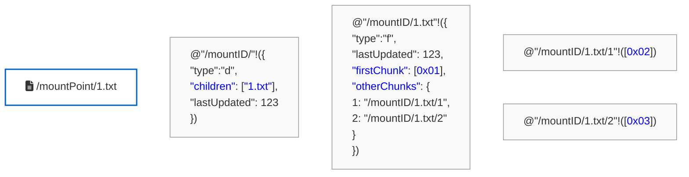

# Rholang Data Storage

This diagram illustrates how data is stored in Rholang, based on the provided screenshot.



### Components of the Storage Model

Based on the `RholangExpressionConstructor` implementation, the Rholang storage mechanism breaks down into the following components:

* **Channel-Based Addressing:** Every piece of data (folders, files, or file chunks) is stored on a unique Rholang channel string denoting its full virtual path. Based on the `InMemoryFileSystem`, the base path (e.g., `"/mountID"`) acts as a root namespace that securely includes the user's blockchain wallet address (like `"/LOCKED-REMOTE-REV-1111..."`). The `@` syntax quotes this path string to turn it into a Rholang name, and `!` sends the file data payload to that channel.
* **Directory Nodes (`"type": "d"`):** Directories store a directory token containing the `"children"` field and `"lastUpdated"` timestamp. The `"children"` field is a list (or set) of the relative names of the items housed within the directory.
  ```rholang
  // Example (from sendDirectoryIntoNewChannel):
  @"path"!({"type":"d","children":["a","b"],"lastUpdated":123})
  ```
* **File Metadata Nodes (`"type": "f"`):** File nodes store information regarding the file (`"lastUpdated"` timestamp), alongside the `"firstChunk"` of the file (represented as a byte array hex string). Storing the first chunk inline optimizes retrieval for small files without needing to resolve additional channels. Note that file size is dynamically derived during filesystem mounts, rather than explicitly saved on-chain.
  ```rholang
  // Example (from sendEmptyFileIntoNewChanel):
  @"path"!({"type":"f","firstChunk":[], "otherChunks":{}, "lastUpdated":123})
  ```
* **Data Chunks (`"otherChunks"`):** For larger files, the remainder of the file is divided into additional chunks and published to dynamically generated sub-channels (e.g., `"/mountID/1.txt/1"`). The parent file node maintains an `"otherChunks"` Rholang Map (e.g., `{1: "path"}`) that links the chunk sequence index to its corresponding Rholang channel to ensure ordered file reassembly.
  ```rholang
  // Example Parent mapping (from updateOtherChunksMap):
  for(@v <- @"path"){ @"path"!(v.set("otherChunks", {1:"subChannel"})) }

  // Example Chunk payload (from sendFileContentChunk):
  @"channel"!("base16EncodedChunk".hexToBytes())
  ```

## Synchronization Mechanism

Based on the patterns and structures defined in `RholangExpressionConstructor` and `NotificationConstructor`, the synchronization engine relies on a P2P publish-subscribe model utilizing Rholang's system processes (`grpcTell`).

### Synchronization Components

The synchronization mechanism relies on five discrete Rholang code structures to manage subscriptions, loop notifications, and dispatch gRPC triggers:

#### 1. First Client Subscription (Registry Initialization)
When the first client connects, the client registry Map is natively created on the channel:
```rholang
@"@/mountID/clients"!({
  "client1:51111": { "host": "client1", "port": 51111 }
})
```

#### 2. Appending Subscriptions
For all subsequent clients, the node consumes the existing Map, appends its connection identifiers into the Map via `set`, and republishes it back to the channel:
```rholang
for ( @clients <- @"@/mountID/clients" ) {
  @"@/mountID/clients"!( clients.set("client2:51112", { "host": "client2", "port": 51112 }) )
}
```

#### 3. Removing Subscriptions
When a client goes offline or unmounts the file system, the node consumes the active registry Map, strips its identifier out using `delete`, and republishes it:
```rholang
for ( @clients <- @"@/mountID/clients" ) {
  @"@/mountID/clients"!( clients.delete("client2:51112") )
}
```

#### 4. Emitting Update Events
When a generic file operation occurs locally (e.g. Write, Create, Delete), a payload containing the update configuration (`Reason;Path`) is emitted to the node's local updates channel:
```rholang
@"@/mountID/updates"!("/mountID/subdir")
```

#### 5. Broadcasting the gRPC Notification Loop
An active loop contract consumes any emitted updates alongside the current active generic subscriber list. It parses the Map into a List and performs recursive pattern matching `[head ...tail]` to iterate over all active peers and signal them locally via the `rho:io:grpcTell` system process:
```rholang
new grpcTell(`rho:io:grpcTell`) in {
  contract loop(@clientsList, @updatedPath) = {
    match clientsList {
      [] => Nil
      [head ...tail] => {
        grpcTell!(
          head.nth(1).get("host"),
          head.nth(1).get("port"),
          updatedPath
        ) | loop!(tail)
      }
    }
  } |
  for (@updatedPath <= @"@/mountID/updates"; @clients <= @"@/mountID/clients") {
    loop!(clients.toList(), updatedPath)
  }
}
```

### Rholang Synchronization Structures

* **Client Registry Map (`clients`):**
  Active clients subscribe to filesystem updates by joining a registry kept on the `@"/mountID/clients"` channel. 
  The data structure used is a **Rholang Map**, where the key is a unique client identifier (`"host:port"`) and the value contains the target gRPC connection details (`{"host": "...", "port": 1234}`).
  * **Subscribe:** Consumes the map, appends the new node via `clients.set(...)`, and writes it back.
  * **Unsubscribe:** Consumes the map, removes the node via `clients.delete(...)`, and writes it back.
  
* **Event Loop & `grpcTell`:**
  When a local client modifies a file, it deploys a notification trigger. This deploys a temporary recursive `contract loop(@clientsList, @updatedPath)` that:
  1. Consumes the listener map.
  2. Converts the map to a list (`clients.toList()`).
  3. Iterates through the list using pattern matching (`[head ...tail] =>`).
  4. Dispatches an external network call to each peer using the built-in system process `grpcTell`.

* **Notification Payload (`updates`):**
  The `@updatedPath` event payload dispatched to peers is a serialized, delimited string constructed by `NotificationConstructor.NotificationPayload`. It generally populates the `@"/mountID/updates"` channel. It follows the format `Reason;[OldPath];[NewPath]` (e.g., `"W;/mountID/file.txt"` for a write event).

