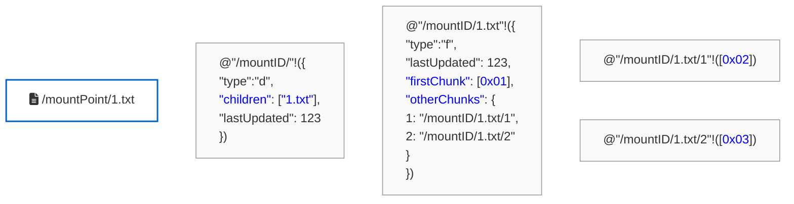

# Rholang Data Storage

This diagram illustrates how data is stored in Rholang, based on the provided screenshot.



### Components of the Storage Model

Based on the `RholangExpressionConstructor` implementation, the Rholang storage mechanism breaks down into the following components:

* **Channel-Based Addressing:** Every piece of data (folders, files, or file chunks) is stored on a unique Rholang channel string denoting its full virtual path. Based on the `InMemoryFileSystem`, the base path (e.g., `"/mountID"`) acts as a root namespace that securely includes the user's blockchain wallet address (like `"/LOCKED-REMOTE-REV-1111..."`). The `@` syntax quotes this path string to turn it into a Rholang name, and `!` sends the file data payload to that channel.
* **Directory Nodes (`"type": "d"`):** Directories store a directory token containing the `"children"` field and `"lastUpdated"` timestamp. The `"children"` field is a list (or set) of the relative names of the items housed within the directory.
  ```rholang
  // Example (from sendDirectoryIntoNewChannel):
  @"path"!({"type":"d","children":["a","b"],"lastUpdated":123})
  ```
* **File Metadata Nodes (`"type": "f"`):** File nodes store information regarding the file (`"lastUpdated"` timestamp), alongside the `"firstChunk"` of the file (represented as a byte array hex string). Storing the first chunk inline optimizes retrieval for small files without needing to resolve additional channels. Note that file size is dynamically derived during filesystem mounts, rather than explicitly saved on-chain.
  ```rholang
  // Example (from sendEmptyFileIntoNewChanel):
  @"path"!({"type":"f","firstChunk":[], "otherChunks":{}, "lastUpdated":123})
  ```
* **Data Chunks (`"otherChunks"`):** For larger files, the remainder of the file is divided into additional chunks and published to dynamically generated sub-channels (e.g., `"/mountID/1.txt/1"`). The parent file node maintains an `"otherChunks"` Rholang Map (e.g., `{1: "path"}`) that links the chunk sequence index to its corresponding Rholang channel to ensure ordered file reassembly.
  ```rholang
  // Example Parent mapping (from updateOtherChunksMap):
  for(@v <- @"path"){ @"path"!(v.set("otherChunks", {1:"subChannel"})) }

  // Example Chunk payload (from sendFileContentChunk):
  @"channel"!("base16EncodedChunk".hexToBytes())
  ```
