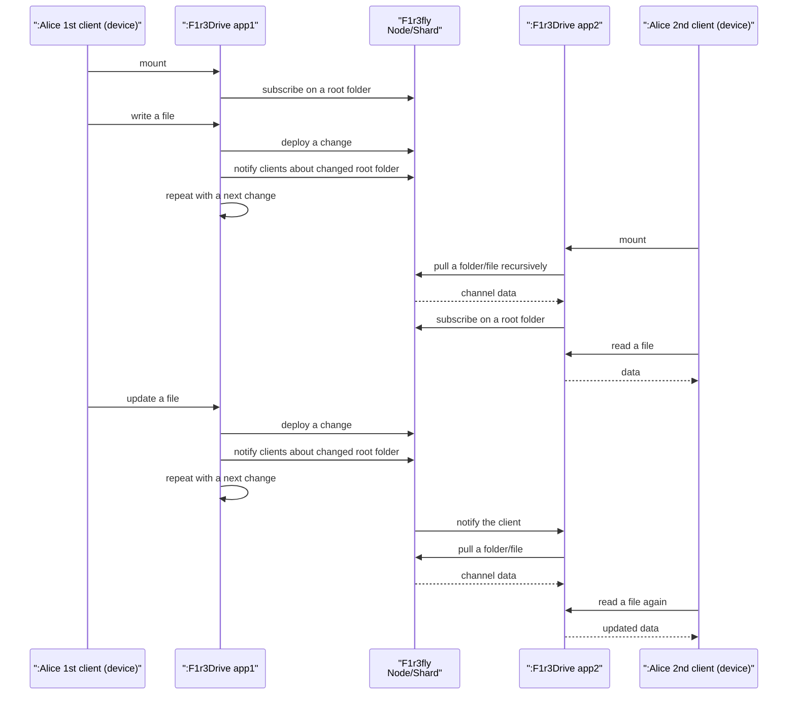

# F1r3Drive System Data Flow

This document illustrates the complete end-to-end synchronization flow for F1r3Drive, detailing both local file reads/writes with a single client and multi-client generic data synchronization.

## Single-Client Local File Operations

This diagram illustrates the high-level data flow within F1r3Drive, detailing how file reads, writes, and background blockchain synchronizations are orchestrated on a single machine.

### Component Breakdown

* **:User**: The end-user or client application interacting with the mounted filesystem.
* **:FS API**: The immediate filesystem interface (such as `InMemoryFileSystem`). It receives direct I/O commands and coordinates with the caching layer and local disk.
* **:Cache API**: Manages the logical representation of the filesystem hierarchy and handles breaking down files into chunks. It organizes files before they are deployed to the blockchain.
* **:Disk**: The local storage where file data is temporarily written before being synced to the blockchain, allowing the filesystem to acknowledge writes immediately without waiting for consensus.
* **:F1r3fly Node/Shard**: The remote blockchain nodes where the `DeployDispatcher` ultimately pushes the chunked data and directory updates in bulk background operations.

## Multi-Client Synchronization Sequence

This sequence highlights how multiple client applications sharing the same filesystem address seamlessly communicate and coordinate dynamic peer-to-peer updates over the blockchain.

### Flow Explanation

1. **Initial Mount & Subscription (Alice 1st client)**: Alice 1st client (device) mounts the filesystem via `F1r3Drive app1`. The application connects to the `F1r3fly Node/Shard` and explicitly subscribes to the root folder of her workspace so it can listen for any remote changes or active signals.
2. **Writing Data (Alice 1st client)**: Alice 1st client (device) creates or writes to a local file. `App1` deploys this serialized raw file data (metadata and chunks) back to the Node. It immediately dispatches an ensuing "notification deploy" to alert any potential external listeners that the contents of the root folder are modified. This sub-loop cascades internally for batched modifications (`repeat with a next change`).
3. **Secondary Mount & Pre-Pull (Alice 2nd client)**: Later, Alice 2nd client (device) mounts the same root folder workspace using `F1r3Drive app2` on a totally separate machine. During the mount handshake, `App2` performs a recursive, exploratory pull of the directory hierarchies and file models already maintained on the Node by the 1st client. Following this initial tree hydration, `App2` embeds its own active gRPC subscription footprint directly onto the root folder.
4. **Initial Local Read (Alice 2nd client)**: Alice 2nd client (device) navigates the freshly mounted filesystem and reads the file locally, which now mirrors the 1st client's initial state exactly.
5. **Updating Live Data (Alice 1st client)**: Alice 1st client (device) modifies the original file again. Analogous to step 2, `App1` immediately streams and pushes strings/updated chunks back to the generic blockchain dataset, subsequently throwing a formal notification trigger towards the subscribed root channel.
6. **Live Synchronization Push (Alice 2nd client)**: Recognizing `App2` is active on the subscription list, the remote Node executes a system-process `grpcTell` hook that issues a concrete notification callback payload back to `App2` over the network. `App2` decodes the updated context string, identifies the `changed root folder`, and transparently requests a pull of the newly altered file/directory layers asynchronously into its cache.
7. **Refreshed Read (Alice 2nd client)**: Because `App2` preemptively handled the delta fetch via the prior `grpcTell` prompt, as Alice 2nd client (device) attempts to read the file again, the mount instantly provides the live, thoroughly updated data seeded natively by the 1st client's interactions.
