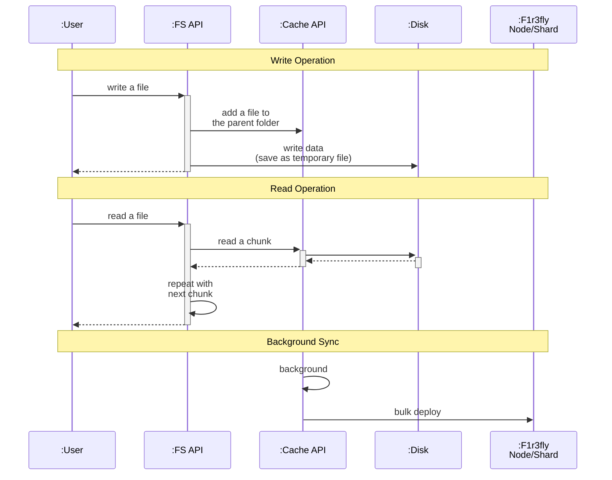

# F1r3Drive Flow Diagram

This diagram illustrates the high-level data flow within F1r3Drive, detailing how file reads, writes, and background blockchain synchronizations are orchestrated.

### Component Breakdown

* **:User**: The end-user or client application interacting with the mounted filesystem.
* **:FS API**: The immediate filesystem interface (such as `InMemoryFileSystem`). It receives direct I/O commands and coordinates with the caching layer and local disk.
* **:Cache API**: Manages the logical representation of the filesystem hierarchy and handles breaking down files into chunks. It organizes files before they are deployed to the blockchain.
* **:Disk**: The local storage where file data is temporarily written before being synced to the blockchain, allowing the filesystem to acknowledge writes immediately without waiting for consensus.
* **:F1r3fly Node/Shard**: The remote blockchain nodes where the `DeployDispatcher` ultimately pushes the chunked data and directory updates in bulk background operations.
